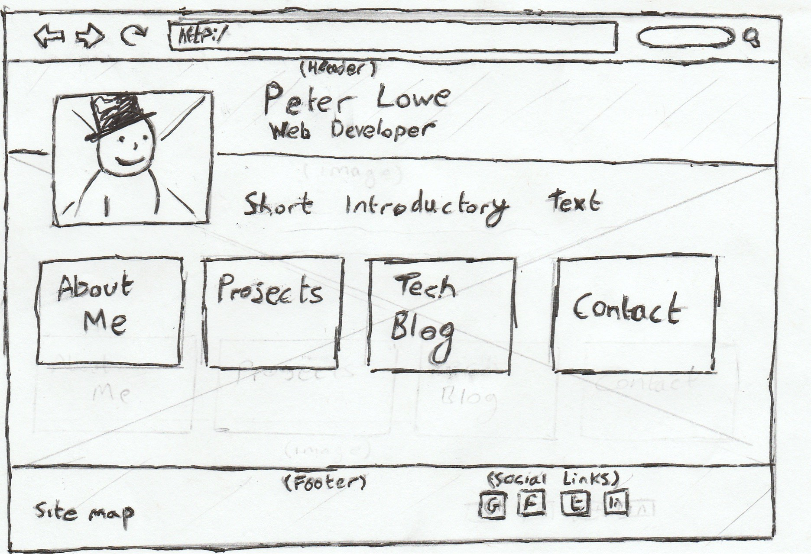

# Solo Challenge 2.8 Reflection

**How was your experience translating a wireframe into HTML?**

  It's hard to say.  It was nice to put some more html into practice but I felt like at this point without any CSS to control the layout the results bare little resemblance to my wireframes.  I think I have all the basic html elements that I need to make something that looks like my wireframes but until I get into CSS next week I cannot be sure.  I suspect it is likely that some of this html code will need to be revised to fit in better with what i'm trying to do with CSS next week but i've never worked with either langage before so it's hard to say. 

**What new tricks or elements did you learn about in HTML?**

   I learnt how to create a dropdown menu with the <select> and <option> tags and how to make those choices link to a new page with the 'onchange' argument.  I also did some research into outlining with the <section> and <article> tags but I don't think either of these where nececary for what i was trying to produce.  I may find that I'm wrong on that assumption later on but I can always add them when I need to.

**Are you excited to start incorporating the design you chose next week?**
  
   I'm very excited to learn how CSS and html can work together to style a page.  I'm particularly excited to have a webpage that looks like more than just a list of elements.