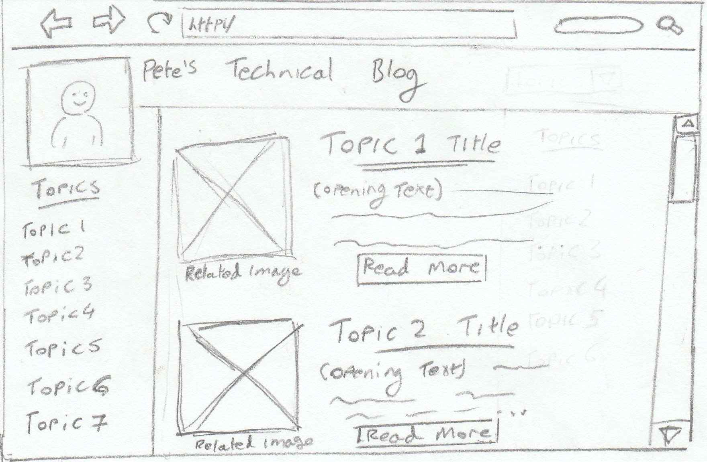

# Wireframe Reflection

**What is a wireframe?**

  A wireframe is a simple dipictin of the elements of a webpage. It does not convay styling but is just a simple black and white representation of the basic layout and functionality.

**What are the benefits of wireframing?**

  Wireframes provide a basic blueprint of the page that you can use as a guide in later stages of development.  They are also a simple way of showing the layout and functionality of the website to the client without getting bogged down by styling.

**Did you enjoy wireframing your site?**

  Yes it was nice to think about how I wanted my layout to work and what basic elements I want the user to see when they load my homepage.

Did you revise your wireframe or stick with your first idea?

  I originaly had my options layed out in a navigation bar just below the header but I realised that as there is going to be very little information on the front page itself this would leave a lot of blank space.  I decided to have the options as large buttons across the center of the page instead.  

**What questions did you ask during this challenge?**

  What do I want the layouts to look like?
  How will the user interact with the pages? 

**What resources did you find to help you answer them?**

   My imagination

**Which parts of the challenge did you enjoy and which parts did you find tedious?**

   I enjoyed sketching out different layout ideas.  I didn't really find any aspect tedious.