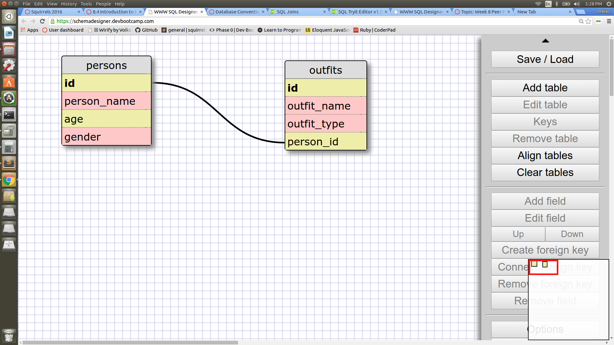

#1
> SELECT*FROM states;

#2
> SELECT*FROM regions;

#3
> SELECT state_name, population FROM states;

#4
> SELECT state_name, population FROM states
> ORDER BY population DESC;

#5 
> SELECT state_name FROM states
> WHERE region_id = 7;

#6
> SELECT state_name, population_density FROM states
> WHERE population_density > 50
> ORDER BY population_density ASC;

#7 
> SELECT state_name FROM states
> WHERE population BETWEEN 1000000 and 1500000;

#8
> SELECT state_name, region_id FROM states
> ORDER BY region_id ASC;

#9
> SELECT region_name FROM regions
> WHERE region_name LIKE '%central%';

#10
> SELECT regions.region_name, states.state_name FROM states
> JOIN regions ON regions.id = states.region_id
> ORDER BY regions.region_name ASC;

# Reflection

## What are databases for?
   For storing large amounts of related data in an organised manner. \

## What is a one-to-many relationship?
   A one to many relationship is where one item in a table is shared by many items in another table.  For example
   many movies can share the same lead actor. 

## What is a primary key? What is a foreign key? How can you determine which is which?
   A primary key is a unique id key for a table it cannot be repeated and is therfore the best way ro identify a specific row in a table.
   A forign key is a key used to refer to a primary key in another table.  For example in the case of a movie database a lead_actor key could refer to a specific actor in an actors table. 

## How can you select information out of a SQL database? What are some general guidelines for that?

  By using the 'SELECT column_name FROM table_name;' this will select all the item from that column of that table.  You can select multiple columns by using a comma in between the coumn names. You can also select all columns in a table by using 'SELECT*FROM table_name'.  There are many other operators that can be used to make the selection more specific or to conrtol the order in wich they are displayed.  The selection statement is always ended by a semicolon. 

