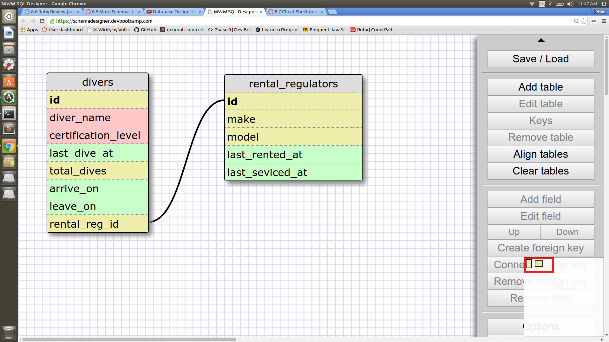
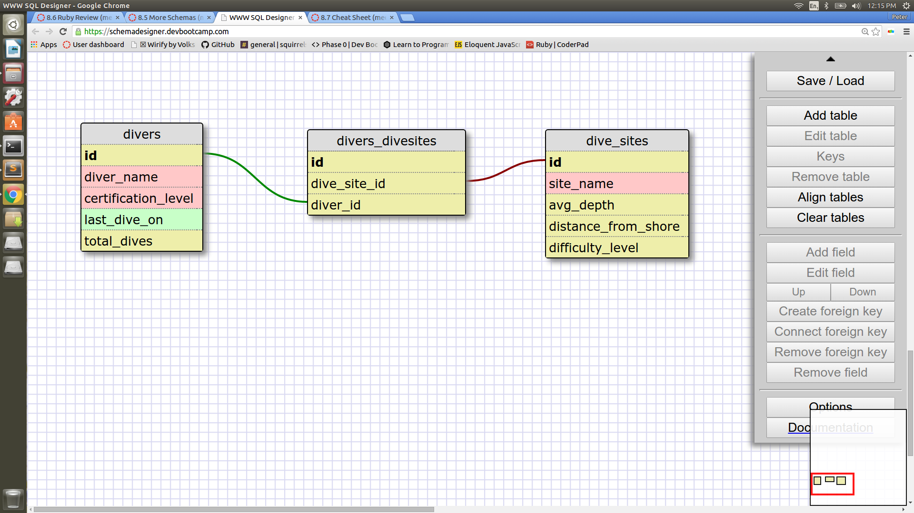

I designed a schema for a datadase to be used by a SCUBA shop to keep track of who is renting their regulators.   Each reltal regulator element can be linked to the rental_reg_id of a diver elememt.  This is a one to one relationshiop because each diver can only rent one regulator and each regulator can only be rente to one diver at a time.  The rental_reg_id field for a diver could be NULL if the diver is not renting a regulator and is using their own instead. 

I've stuck with the SCUBA theame for my many to many relationships.  If a dive shop has divers diving with them for a number of days it's good practice to make sure they are going to different dive sites each time. So it might be useful for the shops database to keep track of which divers have visited which sites.  This is a many to  many relationship because each site can be visited by multiple divers and each diver can visit multiple sites. 

#Reflection

###What is a one-to-one database?
  A one-to-one database is a database where one element form a table is linked to ONLY one other element in another table. 

###When would you use a one-to-one database? (Think generally, not in terms of the example you created).

  One-to-one databases are used in any situation where the two elements being linked can only be linked to one element each.

###What is a many-to-many database?
  
  A many to many database links multiple items from one table to multiple items of another table. 

###When would you use a many-to-many database? (Think generally, not in terms of the example you created).

  Many to many relationships are used when the elements you want to link can all be liked to many other elements.

###What is confusing about database schemas? What makes sense?

  It can somtimes be a little confusing that the rows in a schema represent the columns in the actual database. They are a great way to visually represent how diferent tables interact with eachother. 